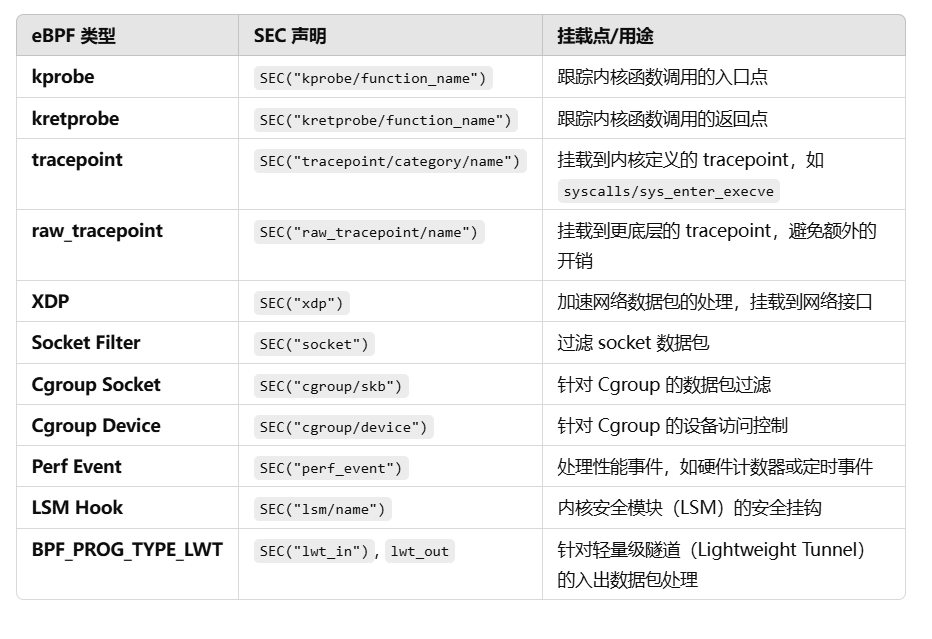
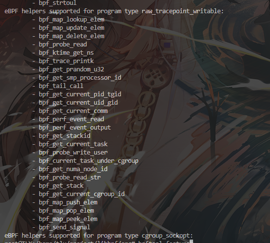
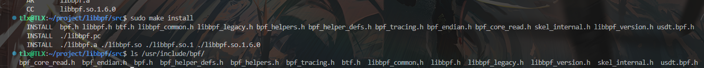

# 1. 自上而下的性能分析方法和计算器体系结构
VTune Amplifier 中的指标采用分层方式组织，用于识别微架构瓶颈。此层次结构和方法称为自上而下的分析方法 - 一种简化、准确且快速的方法，用于识别架构和微架构级别的关键瓶颈。常见的性能瓶颈以分层结构组织，并使用独立于微架构的指标加权其成本。因此，层次结构在处理器代际之间保持一致且向前兼容，从而降低了传统上理解新微架构及其模型特定事件所需的高学习曲线。[1.相关论文查看](https://www.intel.com/content/www/us/en/developer/articles/technical/understanding-how-general-exploration-works-in-intel-vtune-amplifier-xe.html)  [2.相关原理查看](https://www.intel.com/content/www/us/en/developer/articles/technical/understanding-how-general-exploration-works-in-intel-vtune-amplifier-xe.html)[3.分析方法查看](https://www.intel.com/content/www/us/en/docs/vtune-profiler/cookbook/2023-0/top-down-microarchitecture-analysis-method.html#GUID-FEA77CD8-F9F1-446A-8102-07D3234CDB68)

主要特点： 在传统 PMU（性能检测单元）中添加8个简单的新性能事件可以快速且正确地识别目标程序主要的性能瓶颈

分析架构：

# 2. 关键点
## 2.1 使用perf_event_open 
直接使用perf_event_open然后传输目标pid就能区分获取到目标进程的对应硬件计数器信息，对应使用案例可[点击此处](demo/READMD.md)查看具体代码

## 2.2 找出最相关的PMU事件


# 3. 性能瓶颈检测器实现思路
待补充。。。。。。


# 附录. eBPF部分
## 1.  eBPF 程序类型和附加点类型
eBPF程序类型是通过**SEC()宏**在代码中声明的，该宏定义了程序的挂载点

对应的挂载函数可以使用下面命令查看
```c++
su
bpftool feature
```


## 2. 安装教程
```c++
git clone git@github.com:libbpf/libbpf.git
cd libbpf/src
make
sudo make install
////////////////////////////////////////////////////////////////////////////////////////////////////////////////////////
sudo apt install libelf-dev /* 命令行安装libelf，用于加载elf文件(ebpf程序的输出格式) */
sudo apt install clang llvm /* 便于编译epbf文件 */
sudo apt install linux-headers-$(uname -r) /* 安装内核头文件 */
```
出现如下字样即可说明安装成功

