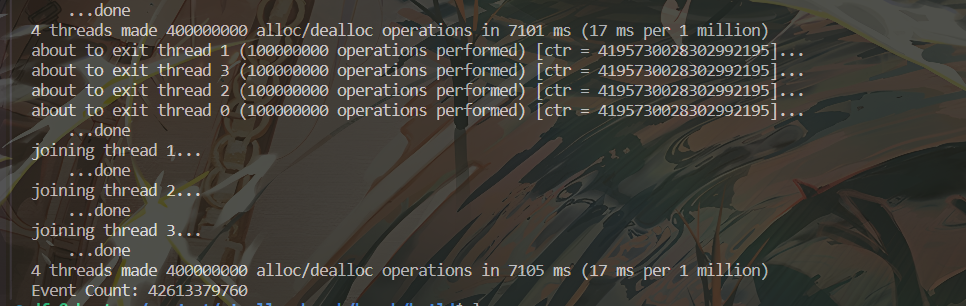

# 1. 自上而下的性能分析方法和计算器体系结构
VTune Amplifier 中的指标采用分层方式组织，用于识别微架构瓶颈。此层次结构和方法称为自上而下的分析方法 - 一种简化、准确且快速的方法，用于识别架构和微架构级别的关键瓶颈。常见的性能瓶颈以分层结构组织，并使用独立于微架构的指标加权其成本。因此，层次结构在处理器代际之间保持一致且向前兼容，从而降低了传统上理解新微架构及其模型特定事件所需的高学习曲线。

[1. 相关论文](https://www.intel.com/content/www/us/en/developer/articles/technical/understanding-how-general-exploration-works-in-intel-vtune-amplifier-xe.html)

[2. 相关原理](https://www.intel.com/content/www/us/en/developer/articles/technical/understanding-how-general-exploration-works-in-intel-vtune-amplifier-xe.html)

[3. 分析方法](https://www.intel.com/content/www/us/en/docs/vtune-profiler/cookbook/2023-0/top-down-microarchitecture-analysis-method.html#GUID-FEA77CD8-F9F1-446A-8102-07D3234CDB68)

主要特点： 在传统 PMU（性能检测单元）中添加8个简单的新性能事件可以快速且正确地识别目标程序主要的性能瓶颈


# 2. eBPF部分
## 2.1 eBPF 程序类型和附加点类型
eBPF程序类型是通过**SEC()宏**在代码中声明的，该宏定义了程序的挂载点

对应的挂载函数可以使用下面命令查看
```c++
su
bpftool feature
```


## 2.2 安装教程
```c++
git clone git@github.com:libbpf/libbpf.git
cd libbpf/src
make
sudo make install
////////////////////////////////////////////////////////////////////////////////////////////////////////////////////////
sudo apt install libelf-dev /* 命令行安装libelf，用于加载elf文件(ebpf程序的输出格式) */
sudo apt install clang llvm /* 便于编译epbf文件 */
sudo apt install linux-headers-$(uname -r) /* 安装内核头文件 */
```
出现如下字样即可说明安装成功


# 3. 关键点
## 3.1 程序上下文参数
所有的ebpf程序都需要一个指针类型的上下文参数，该参数指向的结构体取决于触发的事件类型，ebpf程序员需要根据该参数编写相应的程序。eBPF程序员需要根据该参数编写相应的程序。

目前看来不太现实，太过复杂(内核层面需要检测所有钩子同时筛选出目标pid)

## 3.2 使用perf_event_open
### 指定进程监控 
2024年12月1日： 计划有变，直接使用perf_event_open然后传输目标pid就能区分获取到目标进程的对应硬件计数器信息
```c++
#include <stdio.h>
#include <unistd.h>
#include <sys/syscall.h>
#include <linux/perf_event.h>
#include <string.h>
#include <sys/ioctl.h>
#include <fcntl.h>
#include <sys/wait.h>
#include <sys/ptrace.h>
#include <signal.h>
#include <errno.h>

static long perf_event_open(struct perf_event_attr *hw_event, pid_t pid,
                            int cpu, int group_fd, unsigned long flags)
{
    return syscall(__NR_perf_event_open, hw_event, pid, cpu,
                   group_fd, flags);
}

int main()
{
    struct perf_event_attr pe;
    memset(&pe, 0, sizeof(struct perf_event_attr));

    pe.type = PERF_TYPE_RAW;
    pe.size = sizeof(struct perf_event_attr);
    pe.config = (1 << 24) | (0x01 << 8) | 0xB1; // 正确的事件配置
    pe.disabled = 1;       // 开始时禁用计数器
    pe.exclude_kernel = 1;
    pe.exclude_hv = 1;
    pe.inherit = 1;        // 允许子进程继承计数器

    pid_t pid = fork();
    if (pid == 0) {
        // 子进程

        // 使子进程暂停，等待父进程设置性能计数器
        ptrace(PTRACE_TRACEME, 0, NULL, NULL);
        kill(getpid(), SIGSTOP);

        // 运行目标程序
        execl("./alloc-test", "alloc-test", NULL);

        // 如果 execl 失败
        perror("execl");
        return -1;
    } else if (pid > 0) {
        // 父进程

        // 等待子进程暂停
        int status;
        waitpid(pid, &status, WUNTRACED);
        if (!WIFSTOPPED(status)) {
            fprintf(stderr, "Child did not stop as expected.\n");
            return -1;
        }

        // 打开针对子进程的性能事件
        int fd = perf_event_open(&pe, pid, -1, -1, 0);
        if (fd == -1) {
            perror("perf_event_open");
            return -1;
        }

        // 重置和启动计数器
        ioctl(fd, PERF_EVENT_IOC_RESET, 0);
        ioctl(fd, PERF_EVENT_IOC_ENABLE, 0);

        // 让子进程继续执行
        ptrace(PTRACE_DETACH, pid, NULL, NULL);

        // 等待子进程结束
        waitpid(pid, NULL, 0);

        // 停止计数器
        ioctl(fd, PERF_EVENT_IOC_DISABLE, 0);

        long long count;
        if (read(fd, &count, sizeof(long long)) == -1) {
            perror("read");
            return -1;
        }
 //42591586823
 //42681728693    
        printf("Event Count: %lld\n", count);

        close(fd);
    } else {
        // fork 失败
        perror("fork");
        return -1;
    }

    return 0;
}

```
运行结果与perf运行结果对比如下


### 3.3 多线程监控
```c++
#include <stdio.h>
#include <unistd.h>
#include <sys/syscall.h>
#include <linux/perf_event.h>
#include <string.h>
#include <sys/ioctl.h>
#include <pthread.h>
#include <errno.h>

static long perf_event_open(struct perf_event_attr *hw_event, pid_t pid,
                            int cpu, int group_fd, unsigned long flags)
{
    return syscall(__NR_perf_event_open, hw_event, pid, cpu, group_fd, flags);
}

// 定义线程参数结构体
typedef struct {
    int thread_id;
    long long event_count;
} thread_data_t;

// 模拟任务1：大规模整数加法
void task1() {
    long long sum = 0;
    for (long i = 0; i < 100000000L; i++) {
        sum += i;
    }
}

// 模拟任务2：矩阵乘法
void task2() {
    int size = 100;
    int matrix1[size][size], matrix2[size][size], result[size][size];
    memset(result, 0, sizeof(result));

    for (int i = 0; i < size; i++) {
        for (int j = 0; j < size; j++) {
            matrix1[i][j] = i + j;
            matrix2[i][j] = i - j;
        }
    }

    for (int i = 0; i < size; i++) {
        for (int j = 0; j < size; j++) {
            for (int k = 0; k < size; k++) {
                result[i][j] += matrix1[i][k] * matrix2[k][j];
            }
        }
    }
}

void *thread_function(void *arg)
{
    thread_data_t *data = (thread_data_t *)arg;

    // 配置 perf_event_attr
    struct perf_event_attr pe;
    memset(&pe, 0, sizeof(struct perf_event_attr));
    pe.type = PERF_TYPE_RAW;
    pe.size = sizeof(struct perf_event_attr);
    pe.config = (1 << 24) | (0x01 << 8) | 0xB1; // 正确的事件配置
    pe.disabled = 1;       // 开始时禁用计数器
    pe.exclude_kernel = 1;
    pe.exclude_hv = 1;

    // 打开性能事件计数器
    int fd = perf_event_open(&pe, 0, -1, -1, 0);
    if (fd == -1) {
        perror("perf_event_open");
        pthread_exit(NULL);
    }

    // 启动计数器
    ioctl(fd, PERF_EVENT_IOC_RESET, 0);
    ioctl(fd, PERF_EVENT_IOC_ENABLE, 0);

    // 执行不同任务
    if (data->thread_id == 1) {
        task1();
    } else if (data->thread_id == 2) {
        task2();
    }

    // 停止计数器
    ioctl(fd, PERF_EVENT_IOC_DISABLE, 0);

    // 读取计数器
    if (read(fd, &data->event_count, sizeof(long long)) == -1) {
        perror("read");
        close(fd);
        pthread_exit(NULL);
    }

    close(fd);
    pthread_exit(NULL);
}

int main()
{
    pthread_t threads[2];
    thread_data_t thread_data[2];

    // 创建两个线程
    for (int i = 0; i < 2; i++) {
        thread_data[i].thread_id = i + 1;
        if (pthread_create(&threads[i], NULL, thread_function, &thread_data[i]) != 0) {
            perror("pthread_create");
            return -1;
        }
    }

    // 等待两个线程结束
    for (int i = 0; i < 2; i++) {
        pthread_join(threads[i], NULL);
    }

    // 输出线程的性能事件统计结果
    for (int i = 0; i < 2; i++) {
        printf("Thread %d Event Count: %lld\n", thread_data[i].thread_id, thread_data[i].event_count);
    }

    return 0;
}
```

程序运行结果：

### 3.3 其他事件验证perf pmu掩码的正确性
uops_executed.stall_cycles ： 没有 uops 执行的周期，如果高，表明核心可能被资源冲突、数据依赖或前端瓶颈所阻塞，执行单元利用率低。

uops_executed.cycles_ge_1_uop_exec  ：至少有 1 条 uop 执行的周期，如果低，表明执行单元没有足够的工作负载，可能是前端提供的指令流不足，或者整体任务分配不均匀。

从结果可以看出数值相差不大，在数量级如此庞大的情况下可以近似等于


# 性能瓶颈检测器实现思路


