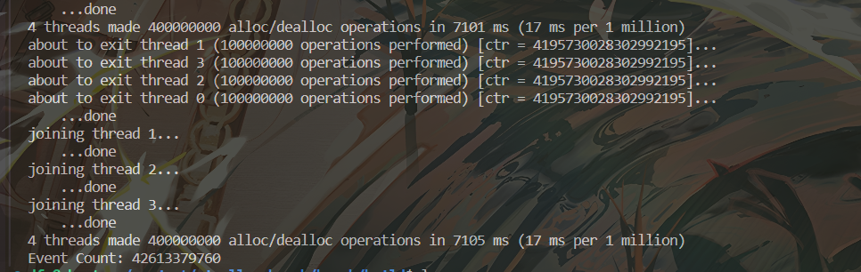
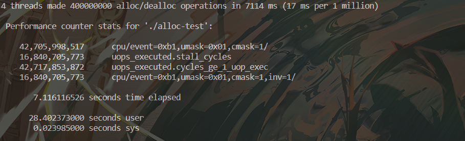

# 此目录主要存放相关的测试程序

特别提示：如果想使用案例之外的事件，可以使用perf list查看系统支持什么事件，然后
gcc -O2 -g -o perf_count_program perf_count_program.c

perf_monitor.cpp : perf_event_open 使用案例
运行结果与perf运行结果对比如下

perf_thread_monitor.cpp :  对每个线程分别计数的使用案例
程序运行结果：

# 其他事件验证perf pmu掩码的正确性
uops_executed.stall_cycles ： 没有 uops 执行的周期，如果高，表明核心可能被资源冲突、数据依赖或前端瓶颈所阻塞，执行单元利用率低。

uops_executed.cycles_ge_1_uop_exec  ：至少有 1 条 uop 执行的周期，如果低，表明执行单元没有足够的工作负载，可能是前端提供的指令流不足，或者整体任务分配不均匀。

从结果可以看出数值相差不大，在数量级如此庞大的情况下可以近似等于

