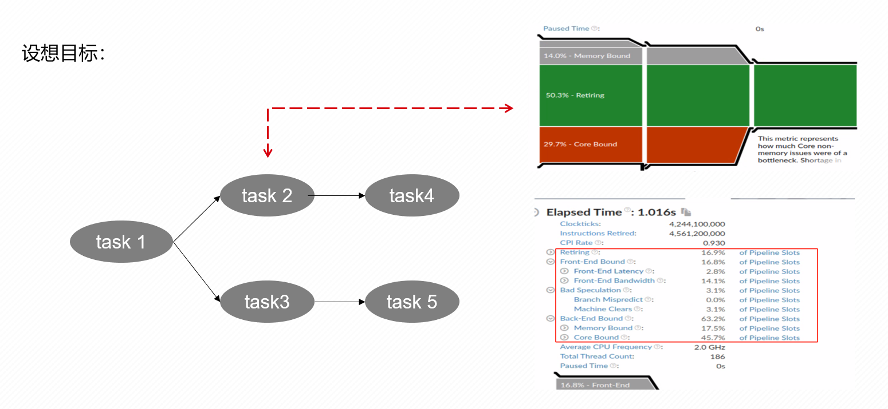
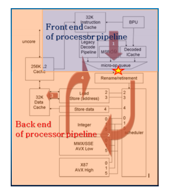
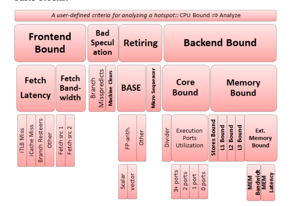

# 功能目标为

在流图执行过程中能对每个task进行具体的瓶颈分析 
# 1. 基本概念
现代CPU的执行过程可以简单分为 ：前端　和　后端

前端负责从内存中获取指令并将其转化为微操作

后端负责原始程序的顺序安排、执行和提交这些ops

## 1.1 自上而下层次分析
英特尔自上而下的分析方法中将程序的执行热点划分成四个部分,分别为

Retiring(正常完成)

Bad Speculation(错误预测)

Frontend Bound(前端瓶颈)

backend bound(后端瓶颈)

           |
## 1.2 使用分析到的硬件计数事件为
所使用的cpu为 Intel(R) Xeon(R) CPU E5-2620 v4 @ 2.10GHz
| 事件名称                                 | 中文解释                           | 事件配置   |
|-----------------------------------------|------------------------------------|------------|
| CPU_CLK_UNHALTED.THREAD                  | 线程运行时未停止的CPU时钟周期数    | cpu/event=0xB1,umask=0x1,cmask=1/    |
| IDQ_UOPS_NOT_DELIVERED.CORE              | 未能交付到执行核心的微操作数       |cpu/event=0x9C,umask=0x1/   |
| UOPS_ISSUED.ANY                         | 发射的所有微操作                   | cpu/event=0x0E,umask=0x1/   |
| UOPS_RETIRED.RETIRE_SLOTS                | 已退休的微操作槽                   |cpu/event=0xC2,umask=0x2/:p   |
| INT_MISC.RECOVERY_CYCLES                 | 由于中断等导致的恢复周期           | cpu/event=0x0D,umask=0x3,cmask=1/   |
| BR_MISP_RETIRED.ALL_BRANCHES             | 所有分支错误预测的次数             | cpu/event=0xC5,umask=0x0/    |
| MACHINE_CLEARS.COUNT                     | 机器清除次数（管道被清除）         | cpu/event=0xC3,umask=0x1,cmask=1,edge=1/    |
| IDQ.MS_UOPS                             | 微指令队列（Micro Sequencer）微操作数 | cpu/event=0x79,umask=0x30/   |
| CYCLE_ACTIVITY.CYCLES_NO_EXECUTE         | 无执行的周期数                     | cpu/event=0xA3,umask=0x4,cmask=4/    |
| RS_EVENTS.EMPTY_CYCLES                   | 由于调度队列空导致的周期           | cpu/event=0x5E,umask=0x1/   |
| UOPS_EXECUTED.THREAD                     | 线程中执行的微操作数               | cpu/event=0xB1,umask=0x1/   |
| CYCLE_ACTIVITY.STALLS_MEM_ANY            | 由于内存相关的停顿周期             | cpu/event=0xA3,umask=0x6,cmask=6/    |
| RESOURCE_STALLS.SB                       | 由于资源相关的停顿周期             | cpu/event=0xA2,umask=0x8/    |
| CYCLE_ACTIVITY.STALLS_L1D_MISS           | 由于L1数据缓存未命中导致的停顿周期 | cpu/event=0xA3,umask=0xC,cmask=12/   |
| CYCLE_ACTIVITY.STALLS_L2_MISS            | 由于L2缓存未命中导致的停顿周期     |cpu/event=0xA3,umask=0x5,cmask=5/   |
| CYCLE_ACTIVITY.STALLS_MEM_ANY           | 由于内存子系统未完成的请求导致的停顿周期 | cpu/event=0xA3,umask=0x6,cmask=6/ |
| CPU_CLK_UNHALTED.THREAD                 | 线程未停顿的总时钟周期数             | cpu/event=0x3C,umask=0x00/       |
| CYCLE_ACTIVITY.CYCLES_NO_EXECUTE        | 没有执行任何微操作的周期             | cpu/event=0xA3,umask=0x4,cmask=4/ |

## 1.3 英特尔自顶向上计算方式中所使用的计算方式为
**使用分析到的硬件计数事件为**
| Metric Name   | Intel Core events | 
|---------------|-------------------|
| **Clocks**             | _CPU_CLK_UNHALTED.THREAD_                                                                                 | 
| **Slots**              | 4 * Clocks                                                                                               | 
| **Frontend Bound**     | IDQ_UOPS_NOT_DELIVERED.CORE / Slots                                                                       | 
| **Bad Speculation**    | (UOPS_ISSUED.ANY - UOPS_RETIRED.RETIRE_SLOTS + 4*INT_MISC.RECOVERY_CYCLES) / Slots                         |
| **Retiring**           | UOPS_RETIRED.RETIRE_SLOTS / Slots                                                                         |
| **Frontend Latency Bound** | IDQ_UOPS_NOT_DELIVERED.CORE: [≥ 4] / Clocks                                                          |
| **#BrMispredFraction** | _BR_MISP_RETIRED.ALL_BRANCHES_ / (_BR_MISP_RETIRED.ALL_BRANCHES_ + _MACHINE_CLEARS.COUNT_)                 | 
| **MicroSequencer**     | #RetireUopFraction * IDQ.MS_UOPS / Slots                                                                  | 
| **#ExecutionStalls**   | _(CYCLE_ACTIVITY.CYCLES_NO_EXECUTE - RS_EVENTS.EMPTY_CYCLES + UOPS_EXECUTED.THREAD: [≥ 1] - UOPS_EXECUTED.THREAD: [≥ 2]) / Clocks_ | 
| **Memory Bound**       | _(CYCLE_ACTIVITY.STALLS_MEM_ANY + RESOURCE_STALLS.SB) / Clocks_                                           | 
| **L1 Bound**           | _(CYCLE_ACTIVITY.STALLS_MEM_ANY - CYCLE_ACTIVITY.STALLS_L1D_MISS) / Clocks_                               |
| **L2 Bound**           | _(CYCLE_ACTIVITY.STALLS_L1D_MISS - CYCLE_ACTIVITY.STALLS_L2_MISS) / Clocks_                               | 
| **L3 Bound**           | CYCLE_ACTIVITY.STALLS_L2_MISS - CYCLE_ACTIVITY.STALLS_MEM_ANY / Clocks             |
| **Ext. Memory Bound**  | CYCLE_ACTIVITY.STALLS_MEM_ANY / Clocks
| **MEM Bandwidth**      | CYCLE_ACTIVITY.STALLS_MEM_ANY / CYCLE_ACTIVITY.CYCLES_NO_EXECUTE                                                    | 
| **MEM Latency**        | ( CYCLE_ACTIVITY.CYCLES_NO_EXECUTE / CPU_CLK_UNHALTED.THREAD) - MEM Bandwidth

## 1.4 通用定义
### 1.4.1 事件名称
| **事件名称**                | **描述**                                              | **说明**                                   |
|-----------------------------|------------------------------------------------------|----------------------------------------------|
| **TotalSlots**              | Total number of issue-pipeline slots                 | 处理器发射流水线的总槽数                      |
| **SlotsIssued**             | Utilized issue-pipeline slots to issue operations    | 用于发射操作的流水线槽数                      |
| **SlotsRetired**            | Utilized issue-pipeline slots to retire operations   | 用于退休（完成）操作的流水线槽数              |
| **FetchBubbles**            | Unutilized issue-pipeline slots, no backend-stall    | 在无后端阻塞时未被使用的发射流水线槽数        |
| **RecoveryBubbles**         | Unutilized issue-pipeline slots due to recovery      | 由于从错误预测恢复导致未被使用的流水线槽数     |
| **BrMispredRetired**        | Retired miss-predicted branch instructions           | 已退休的错误预测分支指令                      |
| **MachineClears**           | Machine clear events (pipeline is flushed)           | 机器清除事件（导致流水线被刷新）              |
| **MsSlotsRetired**          | Retired pipeline slots supplied by the microsequencer| 微代码顺序器提供的已退休流水线槽数            |
| **OpsExecuted**             | Number of operations executed in a cycle             | 每个周期执行的操作数                           |
| **MemStalls.AnyLoad**       | Cycles with no uops executed, 1 inflight load pending| 没有执行微操作，至少有 1 个未完成加载的周期     |
| **MemStalls.L1miss**        | Cycles with no uops executed, load missed L1 cache   | 没有执行微操作，且加载未命中 L1 缓存的周期     |
| **MemStalls.L2miss**        | Cycles with no uops executed, load missed L2 cache   | 没有执行微操作，且加载未命中 L2 缓存的周期     |
| **MemStalls.L3miss**        | Cycles with no uops executed, load missed L3 cache   | 没有执行微操作，且加载未命中 L3 缓存的周期     |
| **MemStalls.Stores**        | Cycles with few uops executed, no stores issued      | 执行少量微操作，无法发出新的存储操作的周期     |
| **ExtMemOutstanding**       | Outstanding memory requests every cycle              | 每个周期未完成的内存控制器请求数               |

### 1.4.2 通用计算表格
| **Metric 名称**            | **公式**                                                                                      | **说明**                                                                 |
|-----------------------------|---------------------------------------------------------------------------------------------|-----------------------------------------------------------------------------|
| **Frontend Bound**          | FetchBubbles / TotalSlots                                                                  | 前端受限：由于前端气泡未使用的发射槽占比。                                    |
| **Bad Speculation**         | (SlotsIssued – SlotsRetired + RecoveryBubbles) / TotalSlots                                | 错误预测：已发射但未退休的槽数，加上恢复气泡的占比。                          |
| **Retiring**                | SlotsRetired / TotalSlots                                                                  | 已退休：用于退休操作的发射槽占比。                                            |
| **Backend Bound**           | 1 – (Frontend Bound + Bad Speculation + Retiring)                                         | 后端受限：总槽中非前端受限、错误预测或已退休的剩余部分。                      |
| **Fetch Latency Bound**     | FetchBubbles[≥ #MIW] / Clocks                                                              | 取指延迟受限：未使用的前端气泡满足多指令窗口条件的周期占比。                  |
| **Fetch Bandwidth Bound**   | Frontend Bound – Fetch Latency Bound                                                       | 取指带宽受限：前端受限中扣除取指延迟的部分。                                  |
| **#BrMispredFraction**      | BrMispredRetired / (BrMispredRetired + MachineClears)                                      | 分支错误预测比例：错误预测分支退休占所有分支清除的比例。                      |
| **Branch Mispredicts**      | #BrMispredFraction * Bad Speculation                                                      | 分支错误预测：错误预测比例与错误预测槽占比的乘积。                            |
| **Machine Clears**          | Bad Speculation – Branch Mispredicts                                                      | 机器清除：错误预测中扣除分支错误预测的部分。                                  |
| **MicroSequencer**          | MsSlotsRetired / TotalSlots                                                               | 微代码顺序器：微代码顺序器提供的退休槽占总槽的比例。                          |
| **BASE**                    | Retiring – MicroSequencer                                                                 | 基础退休：已退休操作中扣除微代码顺序器贡献的部分。                            |
| **#ExecutionStalls**        | (ΣOpsExecuted[= FEW]) / Clocks                                                            | 执行停顿：少量操作执行引起的周期占比。                                        |
| **Memory Bound**            | (MemStalls.AnyLoad + MemStalls.Stores) / Clocks                                           | 内存受限：内存子系统加载与存储未完成引起的周期占比。                          |
| **Core Bound**              | #ExecutionStalls – Memory Bound                                                          | 核心受限：执行停顿扣除内存受限部分的剩余周期。                                |
| **L1 Bound**                | (MemStalls.AnyLoad – MemStalls.L1miss) / Clocks                                           | L1 缓存受限：加载未命中 L1 缓存之外的停顿周期占比。                           |
| **L2 Bound**                | (MemStalls.L1miss – MemStalls.L2miss) / Clocks                                            | L2 缓存受限：加载未命中 L1 而命中或未命中 L2 的停顿周期占比。                 |
| **L3 Bound**                | (MemStalls.L2miss – MemStalls.L3miss) / Clocks                                            | L3 缓存受限：加载未命中 L2 而命中或未命中 L3 的停顿周期占比。                 |
| **Ext. Memory Bound**       | MemStalls.L3miss / Clocks                                                                 | 外部内存受限：加载未命中 L3 缓存导致的停顿周期占比。                          |
| **MEM Bandwidth**           | ExtMemOutstanding[≥ THRESHOLD] / ExtMemOutstanding[≥ 1]                                   | 内存带宽：内存请求超过阈值的周期占所有未完成内存请求周期的比例。              |
| **MEM Latency**             | (ExtMemOutstanding[≥ 1] / Clocks) – MEM Bandwidth                                         | 内存延迟：未完成内存请求的占比扣除内存带宽后的剩余部分。                      |
